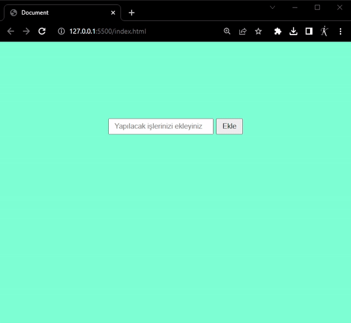

# todo_js

<h3> YAPILACAKLAR LİSTESİ</h3>

Bu projede Javascript kullanarak yapılacak işleri alt alta listeledik

İşlerin durumunu yapıldı - yapılmadı olarak değiştirebiliyoruz

İstenilen her iş listeden silinebiliyor.

---------   ---------   ---------

<h3> TO-DO LIST </h3>

In this project, we used JavaScript to list tasks one by one.

We can change the status of tasks as done or not done.

Any desired task can be deleted from the list.

